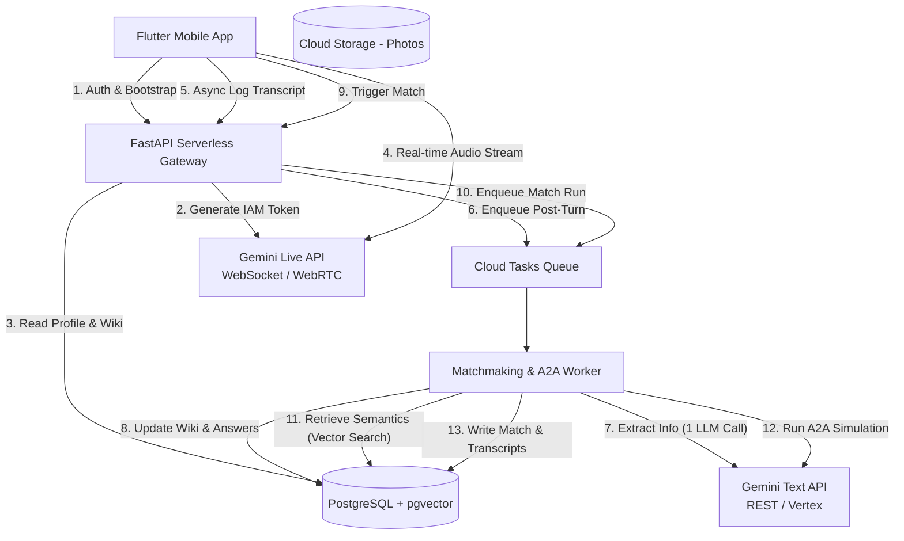

# Ayma: Production-Scale Matchmaking OS
## Re-Architecture & Clean-Slate Implementation Plan

This document outlines the architectural blueprint and execution plan for rebuilding **Ayma** from scratch. It addresses scaling efficiently, real-time Gemini Live WebSocket integration, and a secure, low-latency Agent-to-Agent (A2A) simulation engine.

---

## 1. System Architecture Diagram

Below is the proposed high-level system topology. The client communicates directly with Gemini Live for voice, while metadata, matching, and offline processing are handled by a serverless FastAPI gateway backed by a relational vector database and asynchronous queues.



---

## 2. Core Architectural Upgrades

### A. Single-Call Post-Turn Memory Processor
* **Current Drawback**: The legacy code makes 6 separate LLM calls per turn, risking rate limits and high latency.
* **New Design**: Consolidate memory updates into a single call using Gemini's **Structured Outputs (JSON Schema)**.
* **The Call Structure**:
```json
{
  "wiki_updates": {
    "about_me": "string containing modified about me wiki block",
    "context": "string containing modified context wiki block",
    "preferences": "string containing modified preferences wiki block",
    "matching": "string containing modified matching specs"
  },
  "extracted_answers": [
    { "field_id": "religion", "value": "Christian", "confidence": "high" },
    { "field_id": "lifestyle_drinking", "value": "socially", "confidence": "high" }
  ],
  "answered_question_ids": ["q_religion", "q_drinking"]
}
```

### B. Scalable Database Selection: PostgreSQL with `pgvector`
* **Current Drawback**: Flat Firestore documents do not support geographic queries (e.g., "within 25 miles") and semantic vector search in a single cost-effective query.
* **New Design**: Use PostgreSQL (via Supabase or Google Cloud SQL) with `pgvector` enabled. 
* **Benefits**: Allows us to combine demographic SQL filters (gender interest, age range) and geo-queries (PostGIS) with semantic vector search (e.g., Cosine distance of matching preference embeddings) in a single fast, indexed query.

### C. Client Security & Vertex AI Live Token Service
* **Current Drawback**: Legacy code sends the production `GOOGLE_API_KEY` directly to the client.
* **New Design**: 
  1. The Flutter client calls `/bootstrap`.
  2. The FastAPI backend validates the Firebase JWT.
  3. The backend generates a short-lived, scopes-restricted OAuth token using the Google IAM Credentials API.
  4. The token is returned to the client and used to connect to the Vertex AI Gemini Live endpoint (`generativelanguage.googleapis.com` or Google Cloud Vertex AI endpoint).

---

## 3. Database Schema Blueprint (PostgreSQL)

```sql
-- Enable Extensions
CREATE EXTENSION IF NOT EXISTS "uuid-ossp";
CREATE EXTENSION IF NOT EXISTS "vector";

-- Users Profile Table
CREATE TABLE users (
    id UUID PRIMARY KEY REFERENCES auth.users(id),
    display_name VARCHAR(100),
    age INT,
    gender VARCHAR(20),
    location_point GEOGRAPHY(Point, 4326),
    location_name VARCHAR(200),
    
    -- Onboarding Status
    onboarding_complete BOOLEAN DEFAULT FALSE,
    matching_paused BOOLEAN DEFAULT FALSE,
    
    -- Karpathy-style Memory Wiki (Flat Columns)
    wiki_about_me TEXT DEFAULT '',
    wiki_context TEXT DEFAULT '',
    wiki_preferences TEXT DEFAULT '',
    wiki_matching TEXT DEFAULT '',
    
    -- Embeddings for Matching Preferences
    matching_embedding vector(1536), -- e.g., using text-embedding-3
    
    created_at TIMESTAMP WITH TIME ZONE DEFAULT NOW(),
    updated_at TIMESTAMP WITH TIME ZONE DEFAULT NOW()
);

-- Structured Answers (EAV/JSONB Hybrid for schema flexibility)
CREATE TABLE profile_answers (
    user_id UUID REFERENCES users(id) ON DELETE CASCADE,
    field_id VARCHAR(100),
    value JSONB,
    visibility VARCHAR(20) DEFAULT 'public', -- public, private, sensitive_private
    updated_at TIMESTAMP WITH TIME ZONE DEFAULT NOW(),
    PRIMARY KEY (user_id, field_id)
);

-- Question Checklist Table
CREATE TABLE questions (
    id VARCHAR(100) PRIMARY KEY,
    question_text TEXT NOT NULL,
    category VARCHAR(50), -- required, deeper, matching_prefs
    field_id VARCHAR(100) NOT NULL,
    sort_order INT DEFAULT 99
);

-- User-specific Checklist Progress
CREATE TABLE user_questions (
    user_id UUID REFERENCES users(id) ON DELETE CASCADE,
    question_id VARCHAR(100) REFERENCES questions(id) ON DELETE CASCADE,
    answered BOOLEAN DEFAULT FALSE,
    answered_at TIMESTAMP WITH TIME ZONE,
    PRIMARY KEY (user_id, question_id)
);

-- Matches Table
CREATE TABLE matches (
    id UUID PRIMARY KEY DEFAULT uuid_generate_v4(),
    user_a UUID REFERENCES users(id) ON DELETE CASCADE,
    user_b UUID REFERENCES users(id) ON DELETE CASCADE,
    score NUMERIC(4,3),
    rationale TEXT,
    summary_a TEXT, -- Why B is good for A
    summary_b TEXT, -- Why A is good for B
    status VARCHAR(20) DEFAULT 'pending', -- pending, accepted, rejected
    
    -- Vibe Check Configuration Toggle
    show_simulation_transcript BOOLEAN DEFAULT TRUE,
    
    created_at TIMESTAMP WITH TIME ZONE DEFAULT NOW(),
    updated_at TIMESTAMP WITH TIME ZONE DEFAULT NOW(),
    CONSTRAINT unique_user_pair UNIQUE (user_a, user_b)
);

-- Agent-to-Agent Simulation Transcripts
CREATE TABLE match_simulations (
    id UUID PRIMARY KEY DEFAULT uuid_generate_v4(),
    match_id UUID REFERENCES matches(id) ON DELETE CASCADE,
    sender_uid UUID REFERENCES users(id) ON DELETE CASCADE, -- the identity the bot represents
    turn_index INT NOT NULL,
    message_text TEXT NOT NULL,
    created_at TIMESTAMP WITH TIME ZONE DEFAULT NOW()
);
```

---

## 4. Operational Workflows

### A. The `/bootstrap` Endpoint
1. Client requests session initialization: `POST /bootstrap` with Firebase Auth Header.
2. Gateway verifies user identity.
3. Gateway queries database:
   * Demographics & Wiki details (`wiki_*` columns).
   * Enabled custom skills.
   * Top 5 unanswered required questions from `user_questions`.
4. Assembles the system instruction prompt:
   * Persona instructions (Ayma personality, Tone Mirroring).
   * Extracted Wiki memories.
   * Top missing fields checklist (directs Ayma's conversational objective).
5. Requests a short-lived Vertex AI access token.
6. Returns payload containing the websocket endpoint, authentication token, and configuration.

### B. Asynchronous Post-Turn Flow
```
Client (WebSocket Turn Ended)
  | 
  |-- API: POST /post-turn (raw text snippet)
  v
Gateway (Verifies and responds immediately to keep client lightweight)
  |
  |-- Enqueues Background Task (Cloud Tasks)
  v
Queue Worker
  |
  |-- 1. Calls Gemini Model (Structured JSON Output Mode)
  |      - Ingests: current wiki blocks, profile answers, question list, turn snippet.
  |      - Returns: consolidated JSON of modifications.
  |
  |-- 2. Writes Updates to DB:
  |      - Updates `wiki_*` fields in `users`.
  |      - Upserts changed entries in `profile_answers`.
  |      - Marks corresponding `user_questions` as answered.
  |
  |-- 3. Appends raw text to audit log (for debugging and system evaluation).
```

### C. Two-Stage Matching & Agent-to-Agent Simulation (Vibe Check)
1. **Stage 1 (Database Filtering & Rank)**:
   * SQL query matches candidates by basic demographics (gender, age limits, location range).
   * Computes Cosine Distance between `users.matching_embedding` (embedding of their matching criteria wiki block) to return the top 30 potential candidates.
2. **Stage 2 (Lightweight Score Filter)**:
   * Pairwise profiles are formatted with PII stripped.
   * A cheap model (e.g. Gemini 2.5 Flash) performs initial compatibility evaluations to crop candidates to the top 5.
3. **Stage 3 (A2A Vibe Check & Simulation)**:
   * For each of the top matches, the background worker initializes two LLM system instructions:
     * **Bot A**: Persona representing User A (loaded with A's public wiki and preferences, instructed not to leak secret PII).
     * **Bot B**: Persona representing User B (loaded with B's public wiki and preferences).
   * The worker runs a simulated dialog: Bot A opens $\rightarrow$ Bot B replies $\rightarrow$ Bot A $\rightarrow$ Bot B $\rightarrow$ Bot A $\rightarrow$ Bot B (4 to 6 turns).
   * A final synthesis call reviews the transcript and yields a Synergy Score, Match Rationale, and specific summaries for both users.
   * The simulation transcripts are written to `match_simulations` and the match score is written to `matches`.

---

## 5. Toggleable A2A Transcript Config

To satisfy the user requirement: **"let's show the simulation transcript to users but have the ability to toggle it off in the config"**

### Backend Toggle Logic
We add a configuration setting at the Match level: `show_simulation_transcript`.
* If true: The mobile client fetches all records from `match_simulations` where `match_id = X` and renders them in a styled messaging bubble interface.
* If false: The client only queries the metadata in `matches` (score, summaries, compatibility rationale) and completely hides the raw chat simulation.

```dart
// Flutter Provider UI Logic Check
class MatchDetailScreen extends ConsumerWidget {
  final String matchId;
  const MatchDetailScreen({super.key, required this.matchId});

  @override
  Widget build(BuildContext context, WidgetRef ref) {
    final matchAsync = ref.watch(matchDetailProvider(matchId));

    return matchAsync.when(
      data: (match) {
        return Column(
          children: [
            MatchHeaderWidget(score: match.score, rationale: match.rationale),
            
            // Conditional transcript rendering based on toggled status
            if (match.showSimulationTranscript) ...[
              const Divider(),
              Text("AI Agent Conversation:", style: Theme.of(context).textTheme.titleMedium),
              Expanded(
                child: SimulationTranscriptList(matchId: matchId),
              ),
            ] else ...[
              const Center(
                child: Padding(
                  padding: EdgeInsets.all(16.0),
                  style: TextStyle(fontStyle: FontStyle.italic, color: Colors.grey),
                  child: Text("Simulation details hidden in settings."),
                ),
              )
            ],
          ],
        );
      },
      loading: () => const CircularProgressIndicator(),
      error: (e, s) => Text("Error: $e"),
    );
  }
}
```

---

## 6. Implementation Phasing Roadmap

* **Phase 1: Database Migration**: Spin up PostgreSQL with `pgvector`, migrate schemas from Firestore, and write migration scripts for moving legacy wiki fields.
* **Phase 2: Single-Call Memory Refactor**: Rewrite `/post-turn` to use structured JSON schemas, reducing sequential LLM calls, and implement Google Cloud Tasks queue integration.
* **Phase 3: Secure Vertex Auth Setup**: Configure Google Cloud service accounts to issue short-lived OAuth credentials, replacing static API keys in `/bootstrap`.
* **Phase 4: Match & Simulation Pipeline**: Write the background orchestration scripts for the Stage 1 vector/SQL retrieval, Stage 2 filtering, and Stage 3 Bot-to-Bot conversation loops.
* **Phase 5: Client-Side UI & Toggle Integration**: Update Flutter screens to query matching endpoints, render the transcript bubbles conditionally based on settings config, and add the config toggle switch in User Preferences.