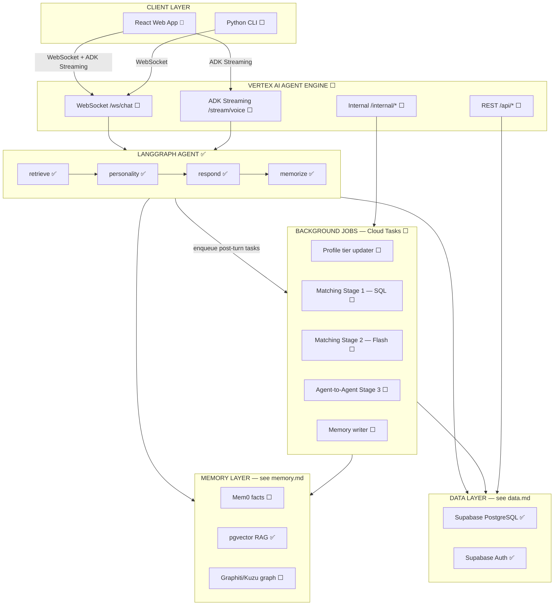
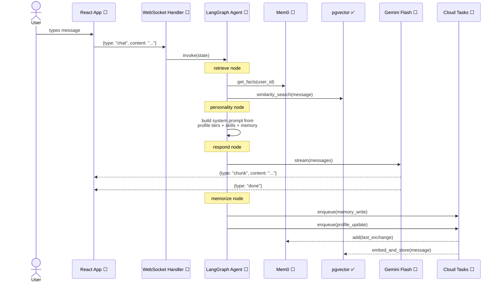
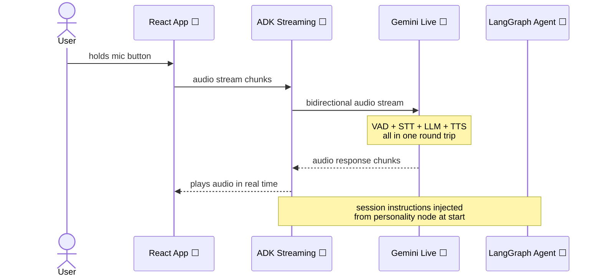
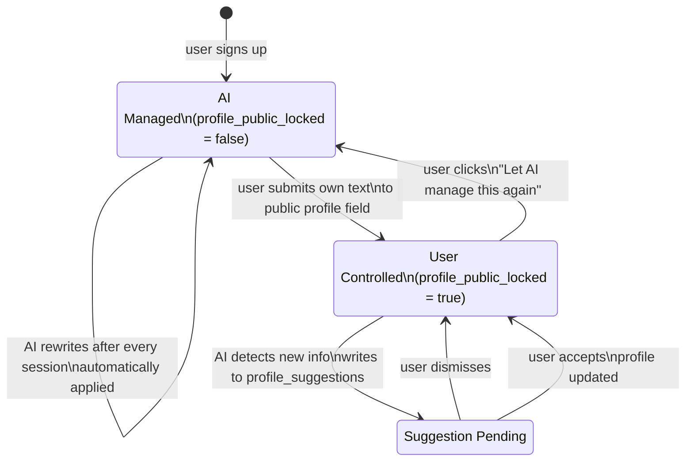
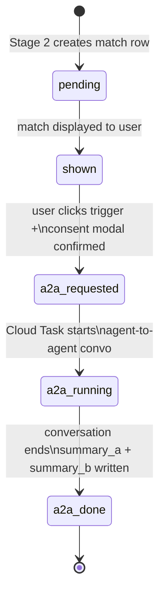

# Ayma — Architecture Overview

> **Legend:**
> - ✅ Implemented
> - 🔄 In progress
> - ⬜ Not started
>
> Click any section heading to drill into the detail doc for that subsystem.

---

## High-Level System Map

---

## Request Flow — Text Chat

How a single user message travels through the system end-to-end.

---

## Request Flow — Voice

---

## Three-Tier Profile State Machine

---

## Match Lifecycle

---

## Implementation Status by Component

| Component | Status | Phase | Detail |
|-----------|--------|-------|--------|
| Supabase schema (all tables) | ✅ | Phase 1 | [data.md](data.md) |
| RLS policies | ✅ | Phase 1 | [data.md](data.md) |
| pgvector + halfvec(3072) | ✅ | Phase 1 | [data.md](data.md) |
| Auth trigger (signup → profile) | ✅ | Phase 1 | [data.md](data.md) |
| System skills (tone_mirror, deep_recall) | ✅ | Phase 1 | [agent.md](agent.md) |
| Supabase Auth → backend | 🔄 | Phase 2 | [agent.md](agent.md) |
| LangGraph agent graph | ✅ | Phase 2 | [agent.md](agent.md) |
| Mem0 integration | ✅ | Phase 2 | [memory.md](memory.md) |
| Profile tier update pipeline | ✅ | Phase 2 | [agent.md](agent.md) |
| Exclusion detection | ✅ | Phase 2 | [agent.md](agent.md) |
| BYOT key management | ✅ | Phase 2 | [agent.md](agent.md) |
| Voice (Gemini Live) | ✅ | Phase 3 | [agent.md](agent.md) |
| Profile UI | 🔄 | Phase 4 | Auth + profile read done (4.1) |
| Matching Stage 1 (SQL) | ⬜ | Phase 5 | [matching.md](matching.md) |
| Matching Stage 2 (Flash) | ⬜ | Phase 5 | [matching.md](matching.md) |
| Agent-to-Agent Stage 3 | ⬜ | Phase 6 | [matching.md](matching.md) |
| Skill loader + user skills UI | ⬜ | Phase 7 | [agent.md](agent.md) |
| Rate limiting | ⬜ | Phase 7 | — |
| CLI | ⬜ | Phase 7 | — |
