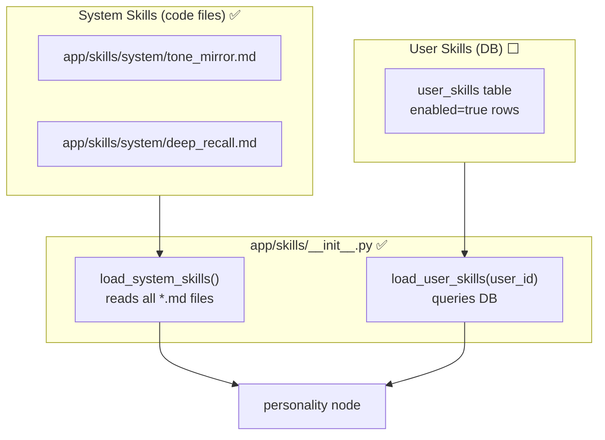
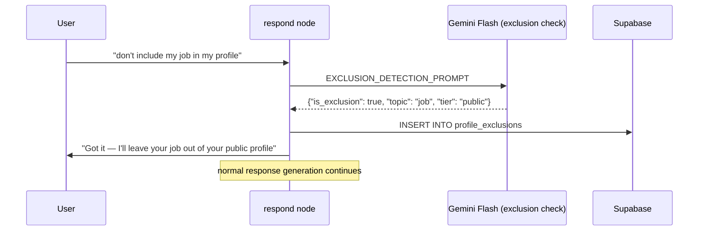
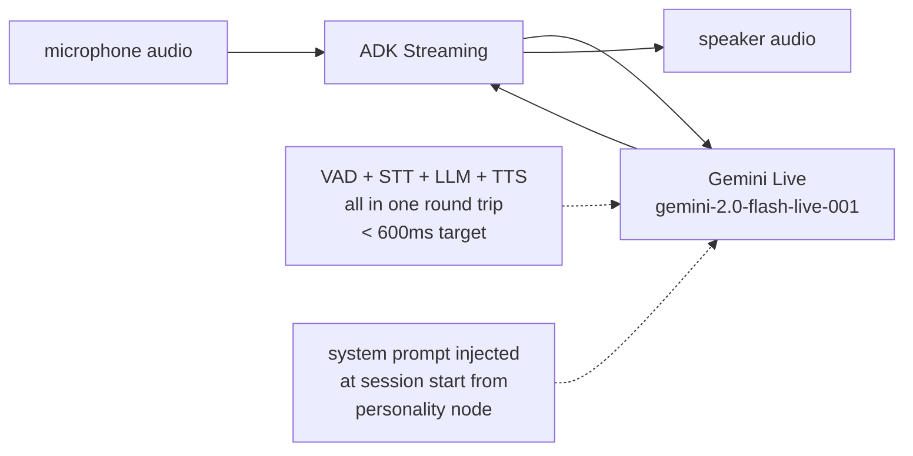

# Agent System

> **Status:** System skills ✅ | LangGraph graph ✅ | Auth wiring ⬜ | Voice ✅
>
> [← Back to Architecture](ARCHITECTURE.md)

---

## The LangGraph Graph

Every user message runs through the same 4-node graph.
Nodes run sequentially. State flows from left to right.

```mermaid
flowchart LR
    Input(["user message"]) --> Retrieve

    subgraph Retrieve["retrieve ⬜"]
        direction TB
        R1["fetch Mem0 facts"]
        R2["pgvector similarity search"]
    end

    subgraph Personality["personality ⬜"]
        direction TB
        P1["load system skills"]
        P2["load user skills from DB"]
        P3["assemble system prompt:\nbase + skills + profile tiers + memory"]
    end

    subgraph Respond["respond ⬜"]
        direction TB
        RS1["detect exclusion intent\n('don't mention my job')"]
        RS2["stream Gemini Flash response"]
        RS3["send chunks to client via WebSocket"]
    end

    subgraph Memorize["memorize ⬜"]
        direction TB
        M1["enqueue memory_write\n(Cloud Tasks)"]
        M2["enqueue profile_update\n(Cloud Tasks)"]
    end

    Retrieve --> Personality --> Respond --> Memorize
    Memorize --> Output(["turn complete"])
```



---

## AgentState — what flows between nodes

```python
class AgentState(TypedDict):
    # Input
    user_id:        str
    session_id:     str
    messages:       list[BaseMessage]   # full conversation history
    mode:           Literal["text", "voice"]

    # Populated by retrieve node
    mem0_facts:     str                 # structured facts about this user
    rag_context:    str                 # relevant past messages

    # Populated by personality node
    system_prompt:  str                 # final assembled prompt

    # Populated by respond node
    response:       str                 # last assistant response
    exclusion_detected: bool            # did user ask to hide something?
    exclusion_topic:    str | None
```

---

## System Prompt Assembly

The personality node builds the system prompt in priority order,
respecting the token budget (1,500 tokens total).

```
[base persona — 200 tokens]
  "You are {user.agent_name}, a personal AI companion..."

[system skills — loaded from app/skills/system/*.md]
  tone_mirror.md    → match user's communication style
  deep_recall.md    → use memory naturally in conversation

[user skills — loaded from user_skills table, enabled=true]
  (empty at MVP for most users)

[profile context — from three-tier profile]
  Private notes:   "User is going through a career change..."
  (public profile not injected — that's for agent-to-agent only)

[memory — from retrieve node]
  Mem0 facts:     600 tokens max
  RAG history:    400 tokens max

[voice modifier — only in voice mode]
  "Keep responses to 1-3 sentences. No markdown..."
```

---

## Skills System



**Adding a new system skill:** drop a `.md` file into `app/skills/system/`.
The loader picks it up automatically — no code change needed.

**web_search** is wired as an ADK tool (not a prompt file) — tools are
registered on the ADK Agent object, not injected as text.

---

## Exclusion Detection

When a user says something like *"don't put my job in my profile"*, the
`respond` node detects this **in-graph** (synchronously) before generating
the response — so the user gets an immediate acknowledgment.



---

## Voice Mode

Voice uses a separate channel (ADK Streaming) but the same agent graph.
The personality node detects `mode = "voice"` and appends the voice modifier.



**Voice modifier (appended to system prompt in voice mode):**
```
You are in a live voice conversation. Rules:
- Keep every response to 1–3 sentences. Never longer.
- No markdown, bullet points, or lists. Speak naturally.
- If you need to think, say "let me think about that" — don't go silent.
- Match the user's energy and pace.
```
