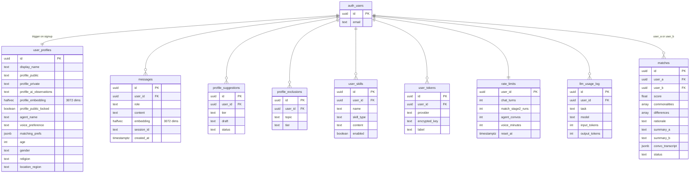

# Data Layer

> **Status:** All tables ✅ | Auth trigger ✅ | Safe view ✅ | RLS ✅
>
> [← Back to Architecture](ARCHITECTURE.md)

---

## Table Relationships



---

## user_profile_safe View

The client **never** reads from `user_profiles` directly. It reads from this view,
which structurally excludes `profile_ai_observations`.

```sql
CREATE VIEW user_profile_safe AS
  SELECT
    id, display_name, created_at, updated_at,
    profile_public, profile_private,
    -- profile_ai_observations intentionally excluded
    profile_public_locked, agent_name, voice_preference,
    matching_prefs, age, gender, religion, location_region
  FROM user_profiles;
```

---

## Who reads/writes what

| Column | Client can read | Client can write | Backend writes |
|--------|----------------|-----------------|----------------|
| `profile_public` | ✅ (via view) | ✅ (if locked=true) | ✅ (if locked=false) |
| `profile_private` | ✅ (via view) | ❌ | ✅ always |
| `profile_ai_observations` | ❌ never | ❌ | ✅ always |
| `profile_embedding` | ❌ | ❌ | ✅ after profile update |
| `profile_public_locked` | ✅ | ✅ | ✅ |

---

## Vector Storage

Both `profile_embedding` and `messages.embedding` use `halfvec(3072)`:
- **Model:** Gemini Embedding 2 (`gemini-embedding-2-preview`)
- **Dims:** 3072
- **Type:** `halfvec` (16-bit float) — half storage vs `vector`, supports hnsw index above 2000 dims
- **Index:** `hnsw` with `halfvec_cosine_ops`
- **Distance metric:** cosine similarity (`<=>` operator)

---

## RLS Policy Summary

| Table | Authenticated user can |
|-------|----------------------|
| `user_profiles` | Read/update own row only |
| `messages` | Read/insert own rows only |
| `matches` | Read rows where they are user_a or user_b |
| `profile_suggestions` | Full CRUD on own rows |
| `profile_exclusions` | Full CRUD on own rows |
| `user_skills` | Full CRUD on own rows |
| `user_tokens` | Read metadata + insert + delete own rows (no update) |
| `rate_limits` | Read own row only (counter updates: service role only) |
| `llm_usage_log` | No access (service role only) |

---

## Auth Trigger

When a user signs up, Supabase fires `on_auth_user_created`, which runs
`public.handle_new_user()` and inserts a row into `user_profiles` automatically.

```sql
-- Critical: SET search_path = public
-- Without this, the trigger can't find user_profiles (search_path defaults to auth)
CREATE OR REPLACE FUNCTION public.handle_new_user()
RETURNS TRIGGER
LANGUAGE plpgsql
SECURITY DEFINER SET search_path = public
AS $$
BEGIN
  INSERT INTO public.user_profiles (id, display_name)
  VALUES (NEW.id, COALESCE(NEW.raw_user_meta_data->>'full_name', ''));
  RETURN NEW;
END;
$$;
```
