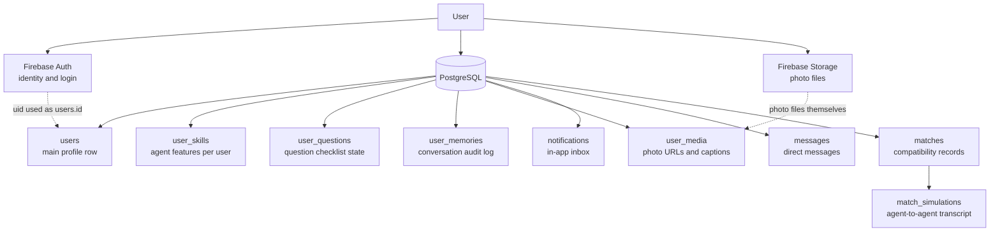
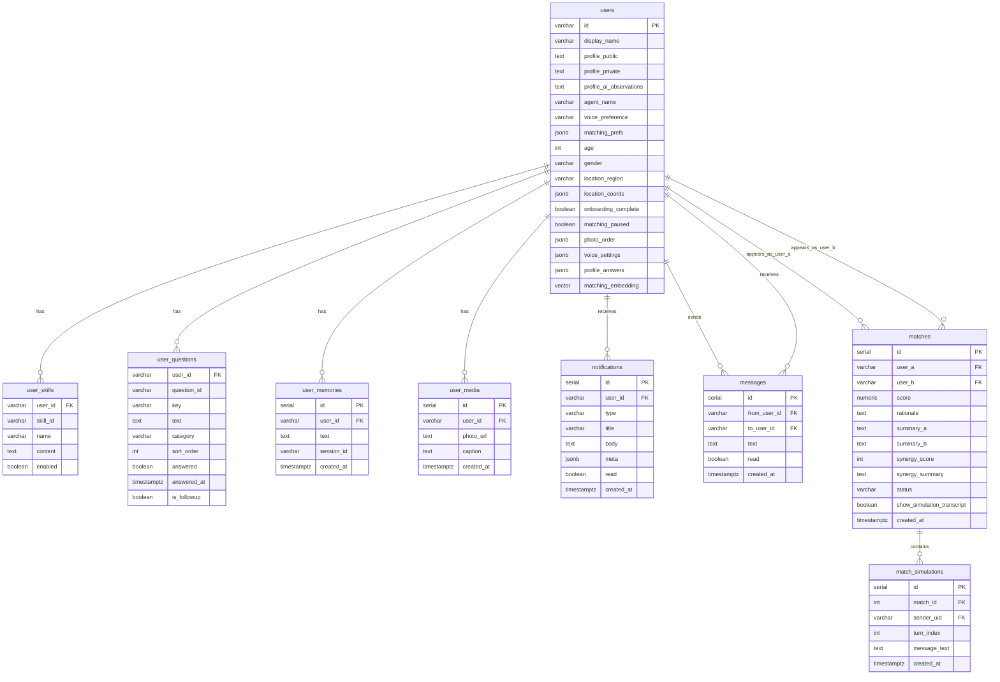
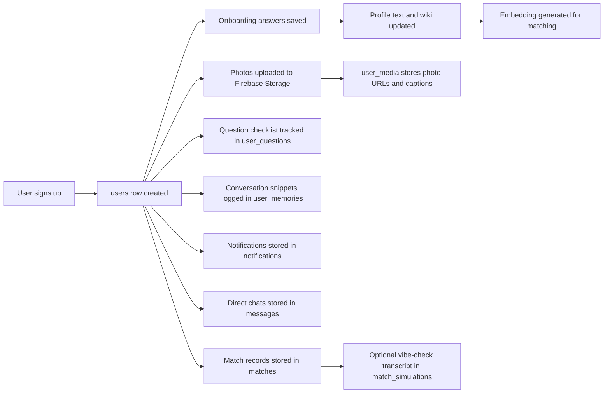

# Ayma Database: What Is Stored Per User

This document explains what PostgreSQL stores for each user in Ayma, how user-linked records relate to each other, and what each database item represents.

Source of truth: [`schema.sql`](../schema.sql)

## At a Glance

## Relationship Map

## What One User Causes To Be Stored

## Table-by-Table Explanation

### `users`

The `users` table is the primary record for each person. There is one row per user, keyed by the Firebase Auth UID.

Important fields:

| Field | What it is |
|---|---|
| `id` | The user’s Firebase Auth UID. |
| `display_name` | User-facing name. |
| `profile_public` | Main public profile summary shown to others. |
| `profile_private` | Private profile notes not meant for public display. |
| `profile_ai_observations` | AI-generated observations about the user. |
| `agent_name` | Name of the AI companion for that user. |
| `voice_preference` | Selected voice for AI interactions. |
| `matching_prefs` | Matching filters and preferences, stored as JSON. |
| `age`, `gender`, `location_region` | Core demographic and location fields used in onboarding and filtering. |
| `location_coords` | Structured location coordinates in JSON. |
| `onboarding_complete` | Whether the user finished onboarding. |
| `matching_paused` | Whether the user is temporarily excluded from matching. |
| `preboarding_seen` | Whether the user has seen the pre-onboarding flow. |
| `photo_order` | Ordered list of the user’s photo IDs or URLs. |
| `voice_settings` | Extra voice configuration in JSON. |
| `profile_public_locked` | Whether public profile editing is locked. |
| `community_profile` | Which community/profile mode this user belongs to. |
| `profile_public_user_edited` | Whether the public profile was manually edited by the user. |
| `profile_public_pending` | Pending public profile draft. |
| `wiki_about_me`, `wiki_context`, `wiki_preferences`, `wiki_matching`, `wiki_profile_structured` | Structured memory/wiki fields built from conversations and profile data. |
| `profile_answers` | Full answer map keyed by field ID. |
| `profile_answers_public` | Public-safe answer subset. |
| `profile_answers_private` | Private answer subset. |
| `profile_answers_sensitive` | Sensitive answers stored separately. |
| `profile_field_visibility` | Visibility rules per field. |
| `raw_user_statements` | Verbatim user statements captured from conversations. |
| `matching_embedding` | 1536-dimension vector used to rank compatibility. |
| `fcm_token` | Push notification token for the device. |
| `created_at`, `updated_at` | Audit timestamps. |

In practice, `users` is the profile, preference, memory-summary, and matching-state table combined into one main row.

### `user_skills`

Per-user AI or agent capabilities.

| Field | What it is |
|---|---|
| `user_id` | Owner of the skill. |
| `skill_id` | Stable skill identifier. |
| `name` | Display name of the skill. |
| `content` | Skill instructions or body text. |
| `enabled` | Whether the skill is active for that user. |

This lets different users have different enabled agent behaviors or instructions.

### `user_questions`

Tracks the user’s questionnaire/checklist state.

| Field | What it is |
|---|---|
| `user_id` | Owner of the question state. |
| `question_id` | Stable question identifier. |
| `key` | Short programmatic key. |
| `text` | The actual question prompt. |
| `category` | Group such as demographics, values, or lifestyle. |
| `sort_order` | Display/order priority. |
| `answered` | Whether the user answered it. |
| `answered_at` | When it was answered. |
| `is_followup` | Whether it is a follow-up question. |

This table stores progress state, not just the answer text. The answers themselves are primarily consolidated into JSON fields on `users`.

### `user_memories`

Conversation memory audit log.

| Field | What it is |
|---|---|
| `id` | Memory row ID. |
| `user_id` | Owner of the memory. |
| `text` | Saved memory text or extracted note. |
| `session_id` | Conversation/session reference. |
| `created_at` | When it was saved. |

This is more like a raw memory timeline, while the `wiki_*` columns on `users` hold the distilled long-term summary.

### `user_media`

Metadata for a user’s photos.

| Field | What it is |
|---|---|
| `id` | Media row ID. |
| `user_id` | Owner of the photo. |
| `photo_url` | URL pointing to the uploaded file. |
| `caption` | Optional caption. |
| `created_at` | When it was added. |

Important distinction: the database stores photo metadata and URLs, but the photo files themselves live in Firebase Storage.

### `notifications`

The user’s in-app inbox.

| Field | What it is |
|---|---|
| `id` | Notification ID. |
| `user_id` | Recipient user. |
| `type` | Notification type, such as match or message. |
| `title` | Short title. |
| `body` | Full notification text. |
| `meta` | Extra structured payload in JSON. |
| `read` | Whether the user opened/read it. |
| `created_at` | Delivery timestamp. |

### `messages`

Direct user-to-user chat messages.

| Field | What it is |
|---|---|
| `id` | Message ID. |
| `from_user_id` | Sender. |
| `to_user_id` | Recipient. |
| `text` | Message body. |
| `read` | Read/unread state. |
| `created_at` | Sent timestamp. |

This table stores person-to-person chat, not user-to-AI chat transcripts.

### `matches`

Compatibility records between two users.

| Field | What it is |
|---|---|
| `id` | Match record ID. |
| `user_a`, `user_b` | The two matched users. |
| `score` | Match score. |
| `rationale` | Why the match was made. |
| `summary_a`, `summary_b` | User-specific summaries for each side. |
| `synergy_score` | Additional vibe/synergy score. |
| `synergy_summary` | Short explanation of the synergy result. |
| `status` | Current match state: `pending`, `accepted`, or `rejected`. |
| `show_simulation_transcript` | Whether to expose the vibe-check transcript. |
| `created_at`, `updated_at` | Match audit timestamps. |

This table is shared by pairs of users. It is not owned by one user, but each user appears in many match rows over time.

### `match_simulations`

Agent-to-agent transcript generated for a match.

| Field | What it is |
|---|---|
| `id` | Simulation line ID. |
| `match_id` | Parent match. |
| `sender_uid` | Which user persona the line is attributed to. |
| `turn_index` | Order within the transcript. |
| `message_text` | Simulated message content. |
| `created_at` | When it was stored. |

This is effectively the stored transcript of the optional AI vibe check for a match.

## What Is Not Stored In PostgreSQL

Some user-related data exists outside the database:

| System | What lives there |
|---|---|
| Firebase Auth | Identity, login credentials, auth tokens. |
| Firebase Storage | The actual uploaded image files. |
| Gemini APIs | Temporary model processing during chat, extraction, and matching. |

PostgreSQL stores the application state and references, not the authentication secrets or raw image binaries.
