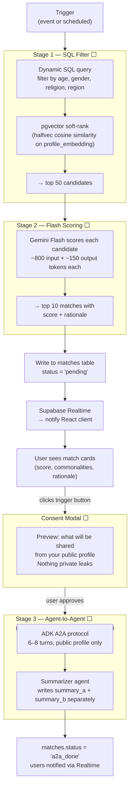
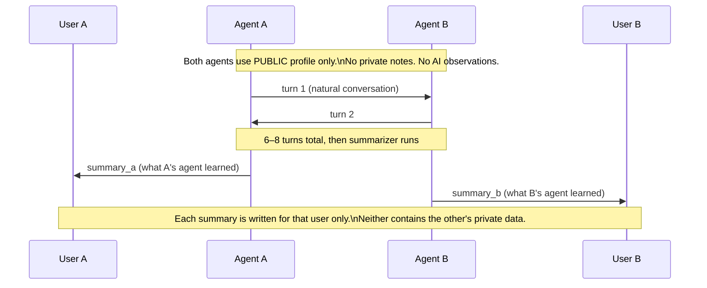

# Matching System

> **Status:** All stages ⬜ (Phase 5–6)
>
> [← Back to Architecture](ARCHITECTURE.md)

---

## Overview — Three Stages



---

## When matching triggers

| Trigger | When | What runs |
|---------|------|-----------|
| Significant memory update | After 5+ new Mem0 facts in a session | Stage 1 + Stage 2 |
| User edits public profile | On save | Stage 1 + Stage 2 |
| Nightly scheduled | 2 AM local | Stage 1 only (refresh candidate pool) |
| User clicks "Find matches now" | Immediate | Stage 1 + Stage 2 |
| User triggers agent convo | Explicit button + consent | Stage 3 only |

---

## Stage 1 — SQL Filter Detail

Stage 1 costs $0 because there is no LLM involved. It's pure SQL + pgvector.

```sql
-- Generated dynamically from user's matching_prefs jsonb
SELECT candidate_id FROM user_profiles
WHERE
  age BETWEEN :min_age AND :max_age
  AND gender = ANY(:preferred_genders)
  AND religion = ANY(:preferred_religions)
  AND location_region = ANY(:preferred_regions)
  AND id != :current_user_id
  AND id NOT IN (
    SELECT CASE WHEN user_a = :uid THEN user_b ELSE user_a END
    FROM matches WHERE user_a = :uid OR user_b = :uid
  )
ORDER BY
  profile_embedding <=> :user_embedding ASC   -- cosine similarity soft-rank
LIMIT 50;
```

The `profile_embedding` column is a `halfvec(3072)` — Gemini Embedding 2 of
the user's public profile. Users with similar public profiles float to the top.

---

## Stage 2 — Flash Scoring Detail

Each of the 50 candidates gets a single Flash call.

**Input per call:** ~800 tokens (User A public + observations + User B public)
**Output per call:** ~150 tokens (structured JSON)
**Total cost for 50 candidates:** ~47,500 input + ~7,500 output tokens
**Flash pricing:** negligible (fraction of a cent)

```
MATCH_SCORE_PROMPT:
  User A public profile
  User A AI observations (internal — User B never sees this)
  User B public profile

→ returns:
{
  "score": 0.0–1.0,
  "top_commonalities": ["...", "..."],
  "key_differences": ["...", "..."],
  "match_rationale": "2-3 sentence explanation"
}
```

**Privacy rule:** Only User A's AI observations are included.
User B's private notes and observations are never sent — User B hasn't consented.

---

## Stage 3 — Agent-to-Agent Detail

Stage 3 never runs automatically. It requires:
1. User sees their match card and clicks "Start conversation"
2. Consent modal shown — preview of what will be shared
3. User explicitly confirms



---

## Rate Limits (per user per day)

| Operation | Limit |
|-----------|-------|
| Chat turns | 500 |
| Stage 2 scoring runs | 5 |
| Stage 3 agent conversations | 3 |
| Voice minutes | 120 |
| Stage 3 max turns | 8 (hard cap) |
| Stage 3 max tokens | 4,000 total |
