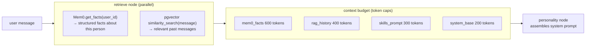
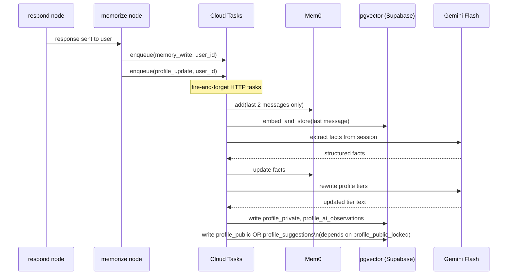
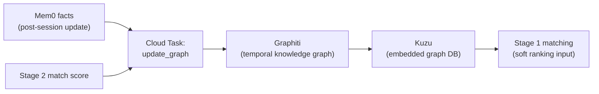

# Memory System

> **Status:** pgvector schema ✅ | Mem0 integration ⬜ | Graphiti ⬜
>
> [← Back to Architecture](ARCHITECTURE.md)

---

## Why three memory layers?

Each layer answers a different question. They do not overlap.

| Layer | Tool | Question it answers | When written | When read |
|-------|------|---------------------|-------------|-----------|
| Conversation history | pgvector (Supabase) | "What did we talk about before?" | Post-turn (Cloud Tasks) | Every turn — retrieve node |
| Personalized facts | Mem0 | "What kind of person is this user?" | Post-turn (Cloud Tasks) | Every turn — retrieve node |
| Relationship graph | Graphiti + Kuzu | "Who should this user meet?" | Post-session (Cloud Tasks) | Stage 1+2 matching only |

---

## How memory is read (per turn)

The `retrieve` node runs at the start of every conversation turn.
It fetches from Mem0 and pgvector **in parallel** to minimise latency.



---

## How memory is written (post-turn)

Memory is **never written mid-conversation** — only after the response is sent.
This keeps the write path out of the critical latency path.



---

## Mem0 — what gets stored

Mem0 stores **structured facts**, not raw messages. Examples:

```
- "User is a software engineer at a startup"
- "User has a dog named Mango"
- "User is vegetarian"
- "User feels anxious about their career direction"
- "User prefers direct communication, dislikes small talk"
```

These are extracted by Gemini Flash after each session and upserted into Mem0.
Mem0 deduplicates and merges facts automatically — if the user says something
that contradicts an old fact, Mem0 updates it.

---

## pgvector RAG — what gets stored

Every message (both user and assistant turns) is embedded with
**Gemini Embedding 2** (`gemini-embedding-2-preview`, 3072 dims, stored as `halfvec`)
and stored in the `messages` table.

At query time, the current user message is embedded and compared against
the user's message history using cosine similarity:

```sql
SELECT content, embedding <=> $1::halfvec AS distance
FROM messages
WHERE user_id = $2
ORDER BY distance ASC
LIMIT 10;
```

The top results are injected into the system prompt as "relevant past context."

---

## Graphiti — relationship graph (matching only)

Graphiti is **not used per-turn**. It is only used by the matching system.

After Mem0 facts are updated, a separate Cloud Task runs Graphiti to update
the knowledge graph with relationship signals between users:
- shared interests extracted from profiles
- compatibility indicators from Stage 2 scores
- temporal changes (e.g. user's stated preferences changed over time)

Kuzu is used as the embedded graph backend — no separate service, runs in-process.



---

## Token budget — why it matters

The system prompt has a hard cap of ~1,500 tokens total.
This leaves 30,000+ tokens for conversation history with Gemini Flash.

If memory retrieval returns too much, the oldest/lowest-priority content is
trimmed. Priority order:

1. `mem0_facts` — highest priority (most useful per token)
2. `rag_history` — capped aggressively (recency > volume)
3. `skills_prompt` — system + user skills
4. `system_base` — base persona
